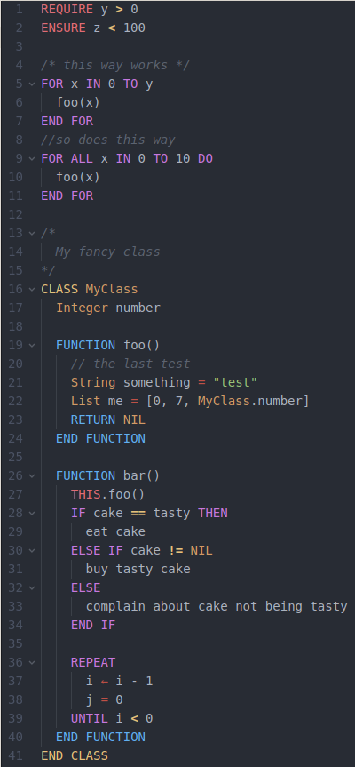

# language-pseudocode package
Have you ever tried to explain an algorithm on a presentation or document and felt the lack of having a standard to
write pseudocode? Well, this Atom package is a syntax highlighter for a pseudocode language.

*It is still in development and open for new contributors.*

## Install
- Install [Atom editor](https://atom.io/)
- cd ~/.atom/packages
- git clone

## Usage
- Open Atom Editor
- Create a file called hello.pseudo
- Learn the language by the examples here

## Language examples
Here you can see some examples. The language is still not complete but can be enough just to write
simple algorithms.

### 1. For
    FOR each component in commit
        component.revisions_twr += twr

        IF is_bug_fix(commit) THEN
          component.fixes_twr += twr
        ENDIF

        IF is_new_author(component, commit.author) THEN
          component.authors_twr += twr
        ENDIF
    ENDFOR

### 2. While
    counter = 0
    WHILE counter < 10
      counter += 1
      print(counter)
    ENDWHILE

### 3. Function
    FUNCTION twr(ti)
        RETURN 1 / (1 + e ^ ( -12 * ti + 12) )
    ENDFUNCTION

### 4. Class
    CLASS person
      name
      email

      FUNCTION person(name, email)
        this.name = name
        this.email = email
      ENDFUNCTION

    ENDCLASS

### 5. Abstract Classes
    ABSTRACT CLASS Data
      URL

      FUNCTION load(filter, callback)
        loadStored(filter, callback)
        sync(filter, callback)
      ENDFUNCTION

      FUNCTION loadStored(filter, callback)
            entities = query(filter)
            callback(entities)
      ENDFUNCTION

      FUNCTION sync(filter, callback)
        entities = request(filter, callback)
        store(entities)
        callback(entities)
      ENDFUNCTION

      FUNCTION ABSTRACT query(filter) // Local database query
      FUNCTION ABSTRACT store(entities) // Saves entities on local database
      FUNCTION ABSTRACT request(filter, callback) // API async JSON request

    ENDCLASS

    CLASS IterationsData EXTENDS DataInterface
      FUNCTION query(filter)
        (...)
      ENDFUNCTION

      FUNCTION store(entities)
        (...)
      ENDFUNCTION

      FUNCTION request(filter)
        (...)
      ENDFUNCTION
    ENDCLASS

### 6. Optional typing
    CLASS person
      string name
      int age
      float weight

      FUNCTION person(string name, int age, float weight)
        this.name = name
        this.age = age
        this.weight = weight
      ENDFUNCTION

    ENDCLASS

### 7. Structures
    list numbers = [1,2,3]
    set lights = {"green", "red", "yellow"}
    map person = {name: "Carlos", age: 12}
